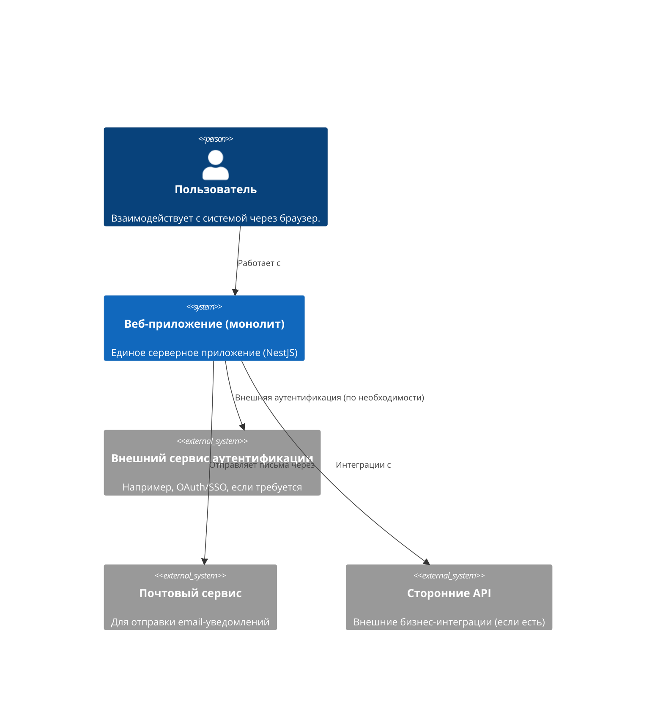

``` markdown
# C4-1 Контекстная диаграмма (Монолит)

Показывает, как пользователь и внешние сервисы взаимодействуют с вашим монолитным приложением.
```

```mermaid
C4Context
Person(user, "Пользователь", "Взаимодействует с системой через браузер.")
System(monolith, "Веб-приложение (монолит)", "Единое серверное приложение (NestJS)")
System_Ext(auth, "Внешний сервис аутентификации", "Например, OAuth/SSO, если требуется")
System_Ext(email, "Почтовый сервис", "Для отправки email-уведомлений")
System_Ext(ext_api, "Сторонние API", "Внешние бизнес-интеграции (если есть)")
Rel(user, monolith, "Работает с")
Rel(monolith, auth, "Внешняя аутентификация (по необходимости)")
Rel(monolith, email, "Отправляет письма через")
Rel(monolith, ext_api, "Интеграции с")
```