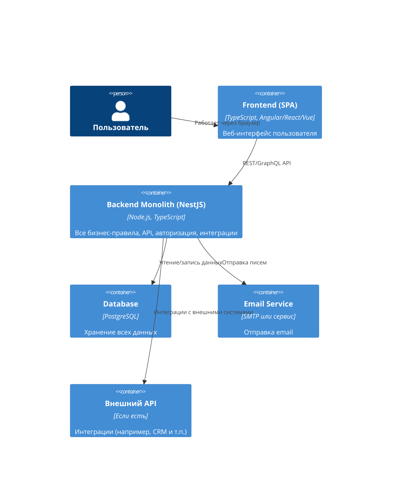

# C4-2 Диаграмма контейнеров (Монолит)

Из каких частей/уровней состоит система, если backend — монолитное приложение.

```mermaid
 C4Container
    Person(user, "Пользователь")
    Container(web, "Frontend (SPA)", "TypeScript, Angular/React/Vue", "Веб-интерфейс пользователя")
    Container(monolith, "Backend Monolith (NestJS)", "Node.js, TypeScript", "Все бизнес-правила, API, авторизация, интеграции")
    Container(db, "Database", "PostgreSQL", "Хранение всех данных")
    Container(email, "Email Service", "SMTP или сервис", "Отправка email")
    Container(ext_api, "Внешний API", "Если есть", "Интеграции (например, CRM и т.п.)")
    Rel(user, web, "Работает через браузер")
    Rel(web, monolith, "REST/GraphQL API")
    Rel(monolith, db, "Чтение/запись данных")
    Rel(monolith, email, "Отправка писем")
    Rel(monolith, ext_api, "Интеграции с внешними системами")
```