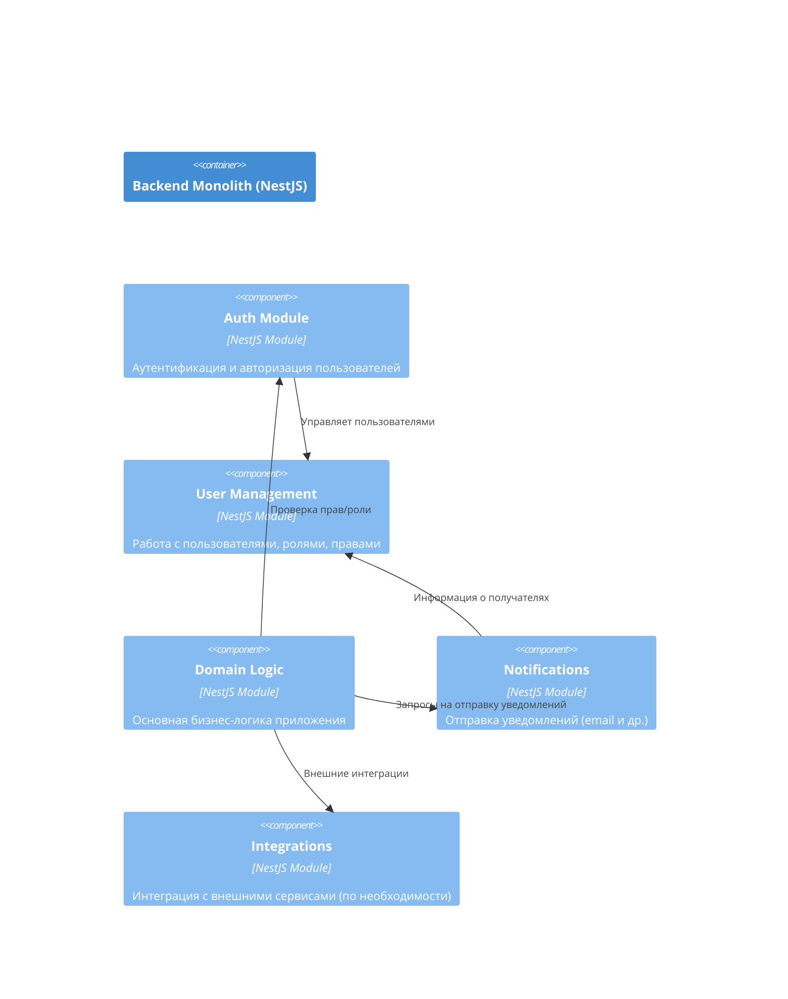

# C4-3 Диаграмма компонентов (Backend — Монолит)

Детализация основных модулей монолитного приложения.

```mermaid
C4Component
    Container(monolith, "Backend Monolith (NestJS)")
    Component(authModule, "Auth Module", "NestJS Module", "Аутентификация и авторизация пользователей")
    Component(userModule, "User Management", "NestJS Module", "Работа с пользователями, ролями, правами")
    Component(domainModule, "Domain Logic", "NestJS Module", "Основная бизнес-логика приложения")
    Component(notifModule, "Notifications", "NestJS Module", "Отправка уведомлений (email и др.)")
    Component(integrationModule, "Integrations", "NestJS Module", "Интеграция с внешними сервисами (по необходимости)")
    Rel(authModule, userModule, "Управляет пользователями")
    Rel(domainModule, authModule, "Проверка прав/роли")
    Rel(domainModule, notifModule, "Запросы на отправку уведомлений")
    Rel(domainModule, integrationModule, "Внешние интеграции")
    Rel(notifModule, userModule, "Информация о получателях")
```