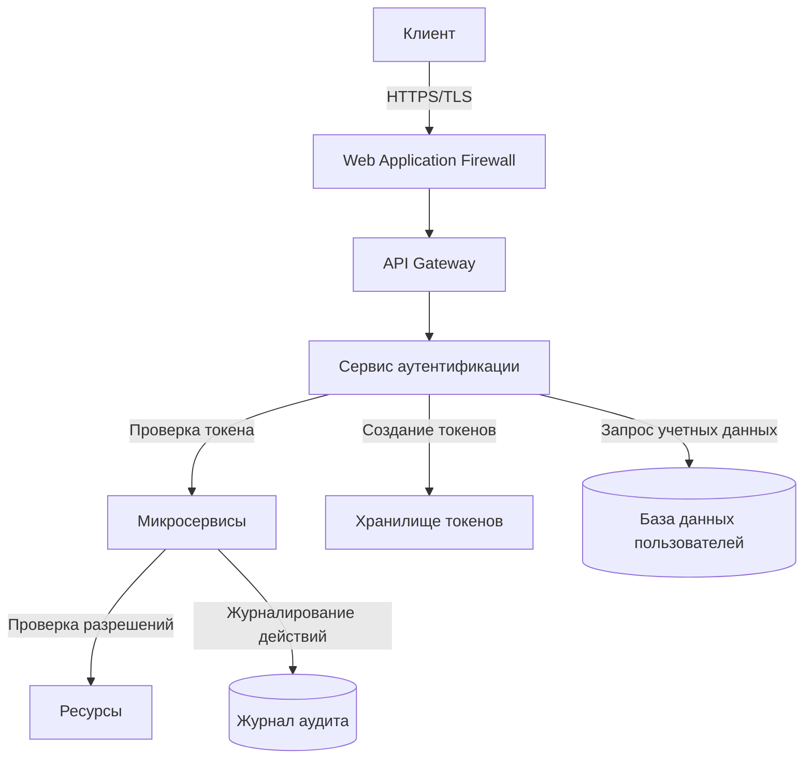

# Архитектура безопасности системы подсчета очков

## Обзор

Данный документ описывает архитектуру безопасности системы подсчета очков, включая механизмы аутентификации, авторизации, защиты данных и контроля доступа.

## Компоненты архитектуры безопасности

### Аутентификация

- **JWT токены**: Система использует JSON Web Tokens (JWT) для аутентификации пользователей
- **OAuth 2.0**: Поддержка внешних поставщиков аутентификации для единого входа
- **Двухфакторная аутентификация (2FA)**: Дополнительный уровень защиты для административных аккаунтов

### Авторизация

- **Ролевая модель доступа (RBAC)**: Контроль доступа на основе ролей пользователей
- **Контроль доступа на уровне ресурсов**: Ограничения доступа к конкретным игровым раундам и данным
- **Динамические политики доступа**: Возможность настройки прав доступа в зависимости от контекста

### Защита данных

- **Шифрование данных в состоянии покоя**: Критические данные хранятся в зашифрованном виде
- **TLS/SSL шифрование**: Все взаимодействия между клиентом и сервером защищены
- **Маскирование конфиденциальных данных**: Личная информация пользователей маскируется в логах и отчетах

## Диаграмма архитектуры безопасности

## Меры безопасности по уровням

### Сетевой уровень
- Web Application Firewall (WAF)
- Защита от DDoS атак
- Ограничение скорости запросов (Rate limiting)

### Уровень приложения
- Проверка входных данных и санитизация
- Защита от CSRF и XSS атак
- Предотвращение SQL-инъекций

### Уровень данных
- Принцип минимальных привилегий
- Разделение данных по уровням конфиденциальности
- Регулярное резервное копирование с шифрованием

## Мониторинг и аудит безопасности

- Централизованное логирование событий безопасности
- Система обнаружения вторжений (IDS)
- Регулярный аудит безопасности и тестирование на проникновение

## Процессы реагирования на инциденты

- Процедуры обнаружения и классификации инцидентов
- Планы реагирования на различные типы угроз
- Процесс уведомления заинтересованных сторон

## Соответствие стандартам

- GDPR
- OWASP Top 10
- Отраслевые стандарты безопасности для игровых приложений