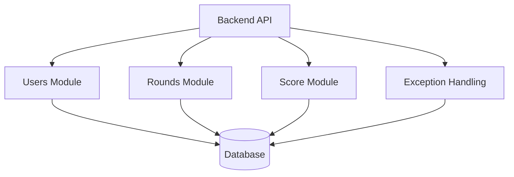

# Компонентная диаграмма: Модули бизнес-логики

> Взаимодействие основных доменных и сервисных модулей приложения (логика игры, обработка ошибок, гарантии целостности).

- Каждая часть логики отделена в свой модуль.
- Все изменения фиксируются транзакционно в базе.
- Подробнее:
    - [02-entities.md](02-entities.md)
    - [03-rounds-and-cooldown.md](03-rounds-and-cooldown.md)
    - [04-score-calculation.md](04-score-calculation.md)
    - [05-exceptions.md](05-exceptions.md)
