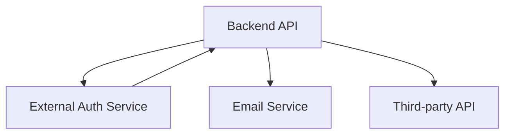

# Компонентная диаграмма: Внешние интеграции

> Отражает точки взаимодействия системы с внешними сервисами (авторизация, email-уведомления, сторонние API).


- Все интеграции реализованы через backend.
- Для каждого сервиса можно дополнительно зафиксировать требования к обмену данными (см. не-функциональные требования и описание API).
- Подробнее:
    - [01-context.md](01-context.md)
    - [11-system-design.md](11-system-design.md)
```
