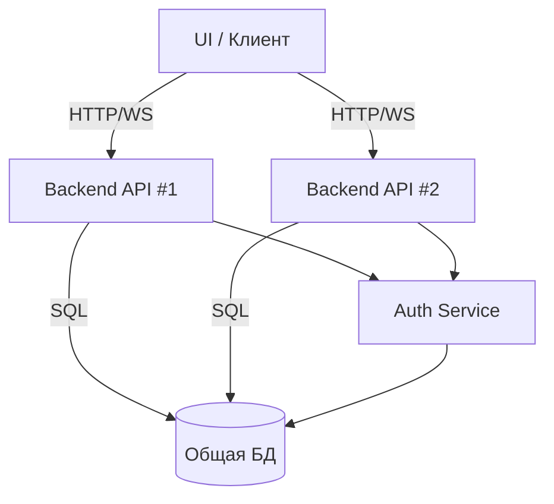

# Компонентная диаграмма: Мультисерверная архитектура

> Иллюстрирует схему отказоустойчивости и масштабирования через несколько backend-инстансов и общую БД.


- Все backend-инстансы работают с одной базой данных и видят актуальные данные.
- Согласованность обеспечивается на уровне БД, синхронизация между серверами специально не реализуется.
- Подробнее: см. [06-multiservers-and-db.md](06-multiservers-and-db.md)
```
