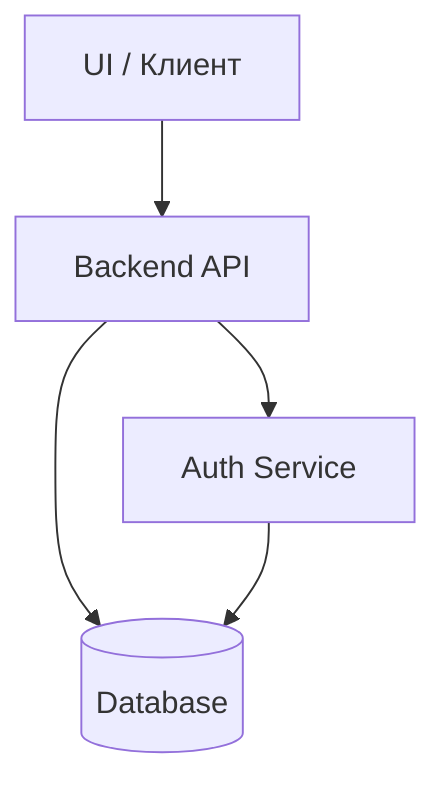

# Компонентная диаграмма (Общая)

> **Назначение**: High-level схема основных компонентов системы.

- Эта диаграмма отражает высокоуровневое разделение компонентов между клиентской частью, сервером, сервисом аутентификации и БД.
- См. более детальные компонентные схемы по отдельным аспектам архитектуры:
    - [Мультисерверная схема](component-diagram-multiserver.md)
    - [Модули бизнес-логики](component-diagram-business.md)
    - [Внешние интеграции](component-diagram-integrations.md)