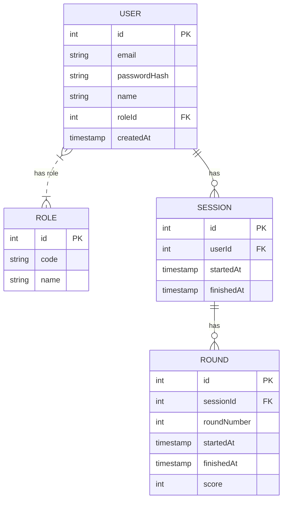

```mermaid
erDiagram
    USER {
        int id PK
        string email
        string passwordHash
        string name
        int roleId FK
        timestamp createdAt
    }
    ROLE {
        int id PK
        string code
        string name
    }
    SESSION {
        int id PK
        int userId FK
        timestamp startedAt
        timestamp finishedAt
    }
    ROUND {
        int id PK
        int sessionId FK
        int roundNumber
        timestamp startedAt
        timestamp finishedAt
        int score
    }
    

    USER }|..|{ ROLE: "has role"
    USER ||--o{ SESSION: has
    SESSION ||--o{ ROUND: has

```