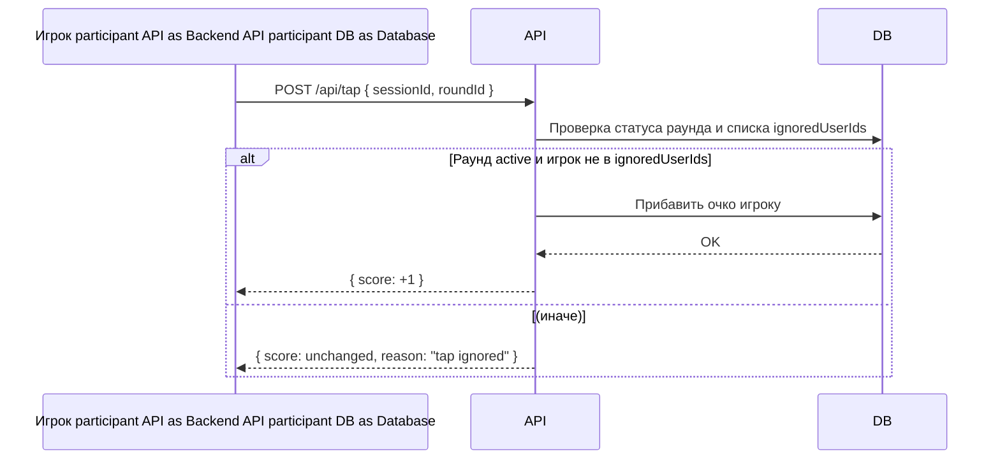

# 7.1. Тап – начисление очков игроку

```mermaid
sequenceDiagram
    participant U as Игрок participant API as Backend API participant DB as Database
    U ->> API: POST /api/tap { sessionId, roundId }
    API ->> DB: Проверка статуса раунда и списка ignoredUserIds
    alt Раунд active и игрок не в ignoredUserIds
        API ->> DB: Прибавить очко игроку
        DB -->> API: OK
        API -->> U: { score: +1 }
    else (иначе)
        API -->> U: { score: unchanged, reason: "tap ignored" }
    end
```