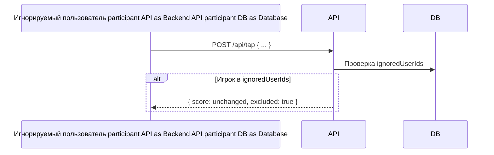

# 7.2. Игнорирование начисления очков для указанных пользователей

```mermaid
sequenceDiagram participant IgnU as Игнорируемый пользователь participant API as Backend API participant DB as Database
IgnU->>API: POST /api/tap { ... }
API->>DB: Проверка ignoredUserIds
alt Игрок в ignoredUserIds
API-->>IgnU: { score: unchanged, excluded: true }
end
```