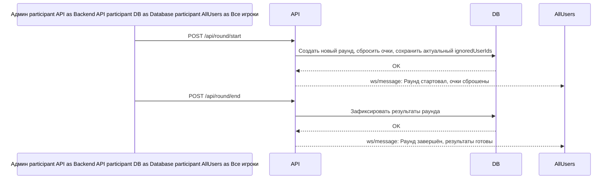

# 7.3. Старт и завершение раунда

```mermaid
sequenceDiagram
    participant Admin as Админ participant API as Backend API participant DB as Database participant AllUsers as Все игроки
    Admin ->> API: POST /api/round/start
    API ->> DB: Создать новый раунд, сбросить очки, сохранить актуальный ignoredUserIds
    DB -->> API: OK
    API -->> AllUsers: ws/message: Раунд стартовал, очки сброшены
    Admin ->> API: POST /api/round/end
    API ->> DB: Зафиксировать результаты раунда
    DB -->> API: OK
    API -->> AllUsers: ws/message: Раунд завершён, результаты готовы
```