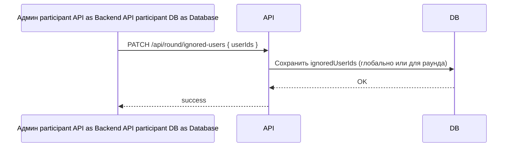

# 7.4. Настройка игнорируемых пользователей

```mermaid
 sequenceDiagram
    participant Admin as Админ participant API as Backend API participant DB as Database
    Admin ->> API: PATCH /api/round/ignored-users { userIds }
    API ->> DB: Сохранить ignoredUserIds (глобально или для раунда)
    DB -->> API: OK
    API -->> Admin: success
```