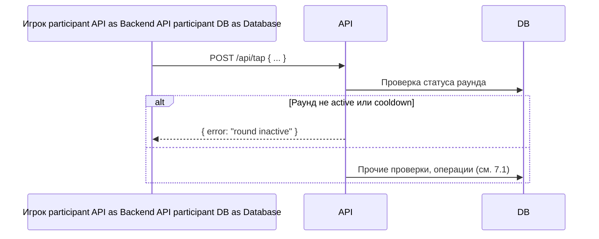

# 7.5. Запрет тапов вне активного раунда

```mermaid
sequenceDiagram
    participant U as Игрок participant API as Backend API participant DB as Database
    U ->> API: POST /api/tap { ... }
    API ->> DB: Проверка статуса раунда
    alt Раунд не active или cooldown
        API -->> U: { error: "round inactive" }
    else
        API ->> DB: Прочие проверки, операции (см. 7.1)
    end
```