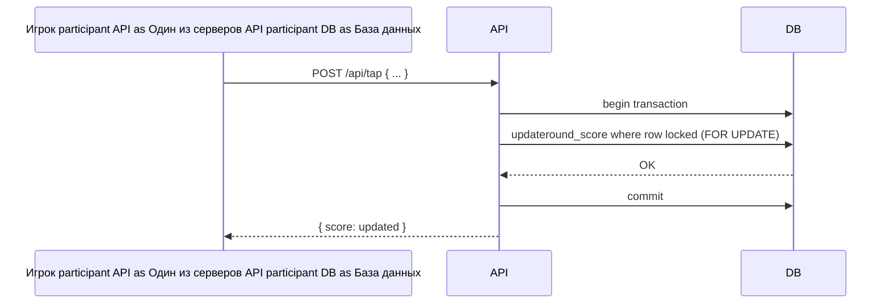

# 7.6. Масштабируемость и консистентность

```mermaid
 sequenceDiagram
    participant U as Игрок participant API as Один из серверов API participant DB as База данных
    U ->> API: POST /api/tap { ... }
    API ->> DB: begin transaction
    API ->> DB: updateround_score where row locked (FOR UPDATE)
    DB -->> API: OK
    API ->> DB: commit
    API -->> U: { score: updated }
``` 

_Комментарий:_  
Используются транзакции или блокировки (FOR UPDATE) для консистентности и отказоустойчивости.

