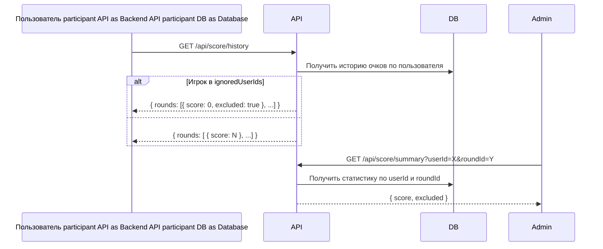

# 7.7. Доступ к статистике и истории

```mermaid
 sequenceDiagram
    participant U as Пользователь participant API as Backend API participant DB as Database
    U ->> API: GET /api/score/history
    API ->> DB: Получить историю очков по пользователя
    alt Игрок в ignoredUserIds
        API -->> U: { rounds: [{ score: 0, excluded: true }, ...] }
    else
        API -->> U: { rounds: [ { score: N }, ...] }
    end

    Admin ->> API: GET /api/score/summary?userId=X&roundId=Y
    API ->> DB: Получить статистику по userId и roundId
    API -->> Admin: { score, excluded }
```