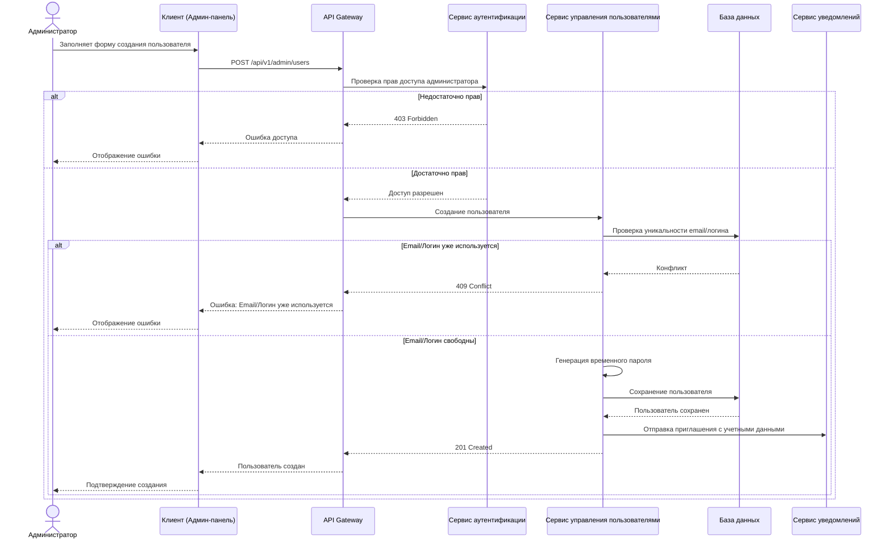
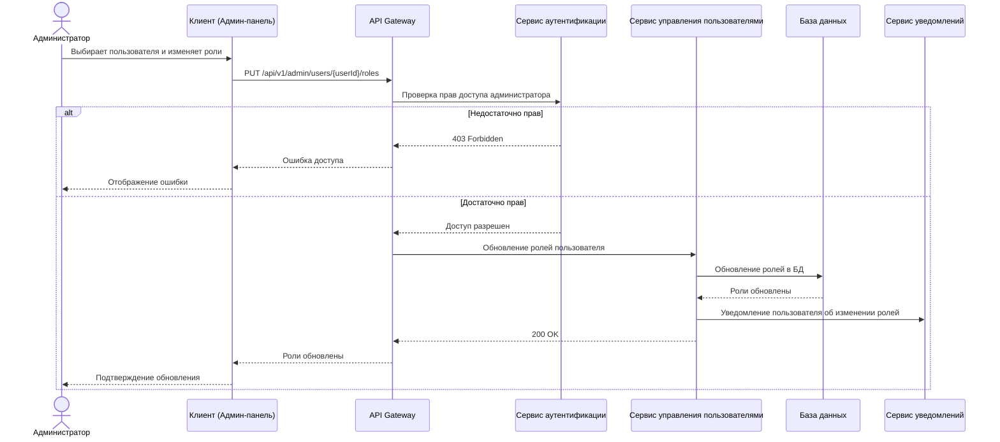
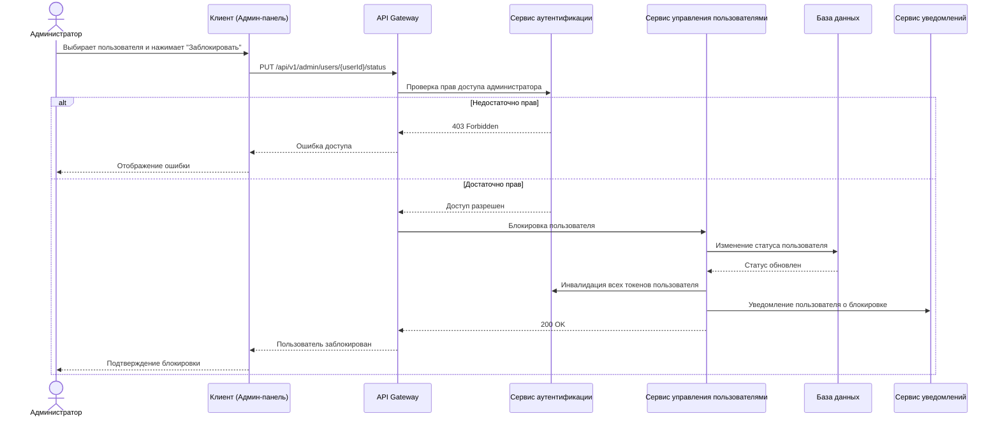
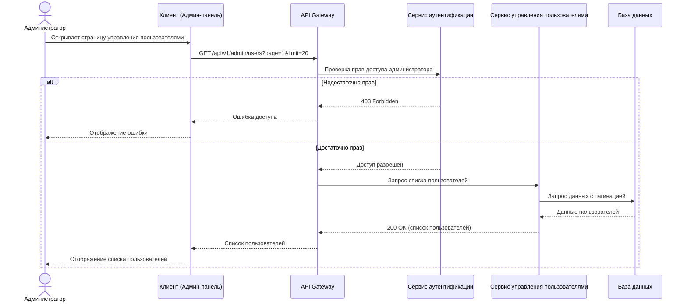

# Sequence-диаграмма 7.9: Управление пользователями
## Описание
Данная диаграмма последовательности описывает процессы управления пользователями в системе подсчета очков, включая создание, обновление, просмотр и удаление пользователей администраторами, а также управление ролями и правами доступа.
## Диаграмма последовательности: Создание пользователя администратором

## Диаграмма последовательности: Управление ролями пользователя

## Диаграмма последовательности: Блокировка пользователя

## Диаграмма последовательности: Просмотр списка пользователей

## Особенности управления пользователями
1. **Иерархия ролей**:
    - Суперадминистратор (полный доступ ко всем функциям)
    - Администратор (управление пользователями и настройками)
    - Модератор (управление игровыми раундами)
    - Пользователь (базовый доступ к системе)
    - Гость (ограниченный доступ только для просмотра)

2. **Аудит действий**:
    - Все действия по управлению пользователями логируются
    - История изменений ролей и статусов пользователей
    - Запись информации о том, кто и когда внес изменения

3. **Массовые операции**:
    - Импорт пользователей из CSV/Excel
    - Массовое назначение ролей
    - Массовая рассылка уведомлений

4. **Самообслуживание пользователей**:
    - Изменение собственного профиля
    - Сброс пароля
    - Настройка двухфакторной аутентификации
