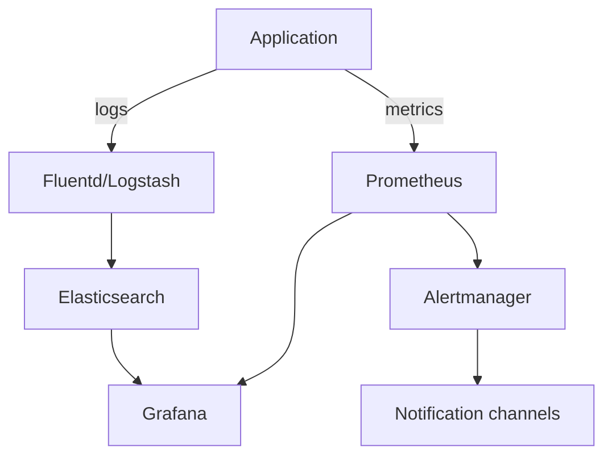

## 4. Документация по мониторингу и обслуживанию системы
# Мониторинг и обслуживание системы

## Содержание

1. [Обзор системы мониторинга](#1-обзор-системы-мониторинга)
2. [Метрики и алерты](#2-метрики-и-алерты)
3. [Логирование](#3-логирование)
4. [Процедуры обслуживания](#4-процедуры-обслуживания)
5. [Резервное копирование и восстановление](#5-резервное-копирование-и-восстановление)
6. [Масштабирование системы](#6-масштабирование-системы)
7. [Отказоустойчивость](#7-отказоустойчивость)
8. [Регламентные работы](#8-регламентные-работы)

## 1. Обзор системы мониторинга

### 1.1 Архитектура мониторинга



### 1.2 Используемые инструменты

- **Prometheus**: сбор метрик приложения и инфраструктуры
- **Grafana**: визуализация метрик и создание дашбордов
- **ELK Stack** (Elasticsearch, Logstash, Kibana): хранение и анализ логов
- **Alertmanager**: управление оповещениями
- **Node Exporter**: мониторинг серверов
- **Blackbox Exporter**: проверка доступности API и веб-сервисов

### 1.3 Точки доступа к инструментам мониторинга

| Сервис     | URL                                                              | Аутентификация                |
|------------|------------------------------------------------------------------|-------------------------------|
| Grafana    | [https://grafana.example.com](https://grafana.example.com)       | LDAP / Локальные пользователи |
| Kibana     | [https://kibana.example.com](https://kibana.example.com)         | LDAP / Локальные пользователи |
| Prometheus | [https://prometheus.example.com](https://prometheus.example.com) | Basic Auth                    |

## 2. Метрики и алерты

### 2.1 Ключевые метрики приложения

| Метрика                           | Описание                       | Пороговые значения    |
|-----------------------------------|--------------------------------|-----------------------|
| `http_request_duration_seconds`   | Время обработки HTTP-запросов  | p95 < 500ms, p99 < 1s |
| `http_requests_total`             | Общее количество запросов      | -                     |
| `http_request_errors_total`       | Количество ошибок              | error rate < 1%       |
| `database_query_duration_seconds` | Время выполнения запросов к БД | p95 < 100ms           |
| `round_active_users`              | Активные пользователи в раунде | -                     |
| `tap_rate`                        | Количество тапов в секунду     | -                     |

### 2.2 Метрики инфраструктуры

| Метрика                       | Описание                 | Пороговые значения |
|-------------------------------|--------------------------|--------------------|
| `node_cpu_usage_percent`      | Использование CPU        | < 80%              |
| `node_memory_usage_percent`   | Использование памяти     | < 90%              |
| `node_disk_usage_percent`     | Использование диска      | < 85%              |
| `node_network_receive_bytes`  | Входящий сетевой трафик  | -                  |
| `node_network_transmit_bytes` | Исходящий сетевой трафик | -                  |

### 2.3 Настройка алертов

Конфигурация в `prometheus/alert-rules.yml`:

``` yaml
groups:
- name: tap-system
  rules:
  - alert: HighErrorRate
    expr: rate(http_request_errors_total[5m]) / rate(http_requests_total[5m]) > 0.01
    for: 5m
    labels:
      severity: critical
    annotations:
      summary: "Высокий процент ошибок в API"
      description: "Процент ошибок превышает 1% за последние 5 минут"

  - alert: SlowAPIResponse
    expr: histogram_quantile(0.95, sum(rate(http_request_duration_seconds_bucket[5m])) by (le)) > 0.5
    for: 5m
    labels:
      severity: warning
    annotations:
      summary: "Медленное время отклика API"
      description: "95-й процентиль времени ответа API превышает 500мс"

  - alert: HighCPUUsage
    expr: avg(node_cpu_usage_percent) by (instance) > 80
    for: 10m
    labels:
      severity: warning
    annotations:
      summary: "Высокая загрузка CPU"
      description: "Средняя загрузка CPU на {{ $labels.instance }} превышает 80% в течение 10 минут"
```

### 2.4 Каналы оповещений

- **Slack**: канал #tap-system-alerts
- **Email**: ops-team@example.com
- **PagerDuty**: для критических алертов в нерабочее время

## 3. Логирование

### 3.1 Структура логов

Все логи должны быть в формате JSON и содержать следующие поля:

- timestamp
- level (info, warn, error, debug)
- service
- message
- context (дополнительная информация)
- request_id (для трассировки запросов)

### 3.2 Уровни логирования

| Уровень | Использование                                           |
|---------|---------------------------------------------------------|
| ERROR   | Ошибки, требующие внимания                              |
| WARN    | Предупреждения, потенциальные проблемы                  |
| INFO    | Стандартные операции, события жизненного цикла          |
| DEBUG   | Подробная информация для отладки (только в dev/staging) |

### 3.3 Хранение логов

- Retention period: 30 дней
- Горячее хранилище: 7 дней
- Холодное хранилище: 23 дня

### 3.4 Полезные запросы для Kibana

``` 
# Поиск ошибок в API
level:ERROR AND service:tap-system-backend

# Поиск медленных запросов
service:tap-system-backend AND duration:>500 AND level:INFO

# Анализ действий пользователя
service:tap-system-backend AND message:"User tap" AND context.userId:12345
```

## 4. Процедуры обслуживания

### 4.1 Ежедневные проверки

- Проверка алертов и инцидентов
- Проверка логов на наличие ошибок
- Проверка использования ресурсов (CPU, RAM, диск)
- Проверка доступности всех компонентов системы

### 4.2 Еженедельные проверки

- Анализ трендов в использовании ресурсов
- Проверка бэкапов
- Анализ производительности
- Проверка обновлений безопасности

### 4.3 Ежемесячные проверки

- Полный аудит безопасности
- Оптимизация базы данных
- Проверка и обновление документации
- Планирование масштабирования (при необходимости)

## 5. Резервное копирование и восстановление

### 5.1 Стратегия резервного копирования

| Компонент        | Частота                  | Метод                  | Хранение           |
|------------------|--------------------------|------------------------|--------------------|
| База данных      | Ежедневно (полное) + WAL | pg_dump, WAL archiving | S3 или эквивалент  |
| Конфигурация     | При изменении            | GitOps                 | Git-репозиторий    |
| Файлы приложения | При деплое               | Docker images          | Container Registry |

### 5.2 Процедура восстановления БД

``` bash
# Остановка приложения
kubectl scale deployment tap-system-backend --replicas=0

# Восстановление из бэкапа
pg_restore -d tap_system backup.dump

# Запуск приложения
kubectl scale deployment tap-system-backend --replicas=3
```

### 5.3 Тестирование восстановления

- Ежемесячное тестирование процедуры восстановления в тестовой среде
- Документирование результатов и времени восстановления

## 6. Масштабирование системы

### 6.1 Горизонтальное масштабирование

``` bash
# Увеличение количества реплик
kubectl scale deployment tap-system-backend --replicas=5

# Автомасштабирование на основе CPU
kubectl autoscale deployment tap-system-backend --min=3 --max=10 --cpu-percent=70
```

### 6.2 Вертикальное масштабирование

``` yaml
# Обновление ресурсов в deployment
resources:
  limits:
    cpu: "2"
    memory: "2Gi"
  requests:
    cpu: "1"
    memory: "1Gi"
```

### 6.3 Масштабирование базы данных

- Использование репликации для распределения нагрузки чтения
- Sharding при необходимости обработки большого объема данных
- Настройка connection pooling

## 7. Отказоустойчивость

### 7.1 Стратегия достижения высокой доступности

- Минимум 3 реплики приложения в разных зонах доступности
- Репликация базы данных с автоматическим failover
- Использование Ingress с несколькими бэкендами
- Circuit breakers для предотвращения каскадных сбоев

### 7.2 Процедуры при отказе компонентов

| Компонент   | Действие при отказе                                  |
|-------------|------------------------------------------------------|
| Pod         | Автоматический перезапуск через Kubernetes           |
| Node        | Автоматическое перепланирование подов на другие узлы |
| База данных | Failover на реплику, проверка целостности данных     |
| Регион      | Переключение на резервный регион (если настроен)     |

## 8. Регламентные работы

### 8.1 Обновление системы

- Обновления выполняются в окно обслуживания: вторник, 02:00-04:00 UTC
- Уведомление пользователей за 24 часа до плановых работ
- Использование rolling updates для минимизации простоя

### 8.2 Чистка данных

- Архивирование старых раундов: ежемесячно
- Очистка логов старше 30 дней: автоматически
- Оптимизация таблиц БД: ежемесячно

