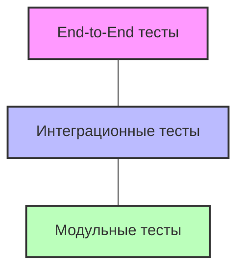

# Стратегия тестирования

## Содержание

1. [Цели и задачи](#цели-и-задачи)
2. [Общие принципы](#общие-принципы)
3. [Пирамида тестирования](#пирамида-тестирования)
4. [Критерии качества](#критерии-качества)
5. [Процесс тестирования](#процесс-тестирования)
6. [Роли и ответственность](#роли-и-ответственность)

## Цели и задачи

Основные цели стратегии тестирования:

- Обеспечение соответствия системы функциональным и нефункциональным требованиям
- Раннее выявление дефектов для снижения стоимости их исправления
- Обеспечение стабильности и надежности работы системы
- Поддержка быстрой и уверенной разработки новых функций
- Предотвращение регрессий при изменении кода

## Общие принципы

1. **Test-Driven Development (TDD)** - написание тестов до реализации функциональности
2. **Автоматизация** - максимальное покрытие кода автоматическими тестами
3. **Непрерывное тестирование** - запуск тестов при каждом коммите через CI/CD
4. **Изоляция тестов** - тесты не должны зависеть друг от друга
5. **Приоритизация** - фокус на критически важных компонентах системы
6. **Мониторинг покрытия** - отслеживание процента покрытия кода тестами

## Пирамида тестирования

Используется классическая пирамида тестирования:

- **Модульные тесты (Unit)**: 70% всех тестов, покрытие > 80%
- **Интеграционные тесты**: 20% всех тестов
- **End-to-End тесты**: 10% всех тестов

## Критерии качества
Минимальные требования для прохождения тестирования:

| Критерий | Целевой показатель |
| --- | --- |
| Покрытие кода модульными тестами | 80% |
| Покрытие бизнес-логики | 100% |
| Успешное прохождение всех тестов | 100% |
| Производительность API | Отклик < 200 мс |
| Масштабируемость | 1000 запросов/с |
| Безопасность | Отсутствие критических уязвимостей |
## Процесс тестирования
1. **Планирование** - определение объема и типов тестов для новой функциональности
2. **Разработка тестов** - создание тест-кейсов и сценариев
3. **Выполнение тестов**:
    - Модульное тестирование на этапе разработки
    - Интеграционное тестирование при сборке
    - End-to-End тестирование в тестовой среде

4. **Анализ результатов** - оценка покрытия и выявленных дефектов
5. **Исправление и повторное тестирование**

## Роли и ответственность

| Роль | Ответственность |
| --- | --- |
| Разработчики | Написание и поддержка модульных и интеграционных тестов |
| QA-инженеры | Разработка и выполнение E2E тестов, проверка покрытия тестами |
| DevOps-специалисты | Настройка и поддержка CI/CD, включая автоматизацию тестирования |
| Руководитель проекта | Контроль качества, принятие решений о готовности релиза |
